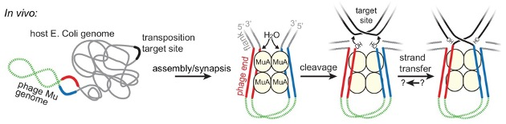
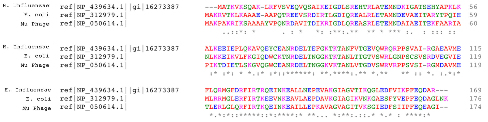
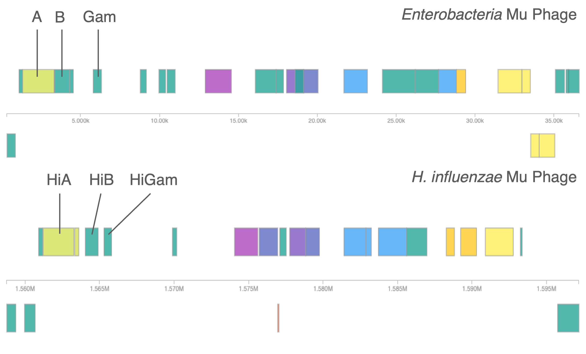
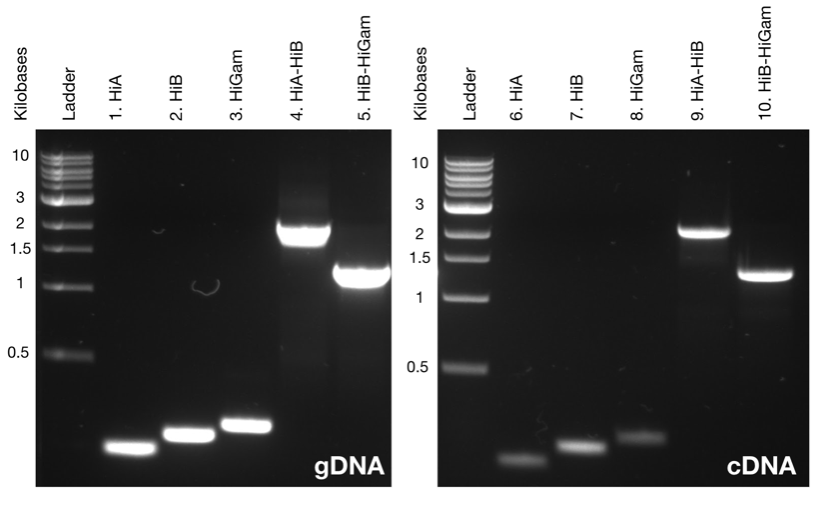
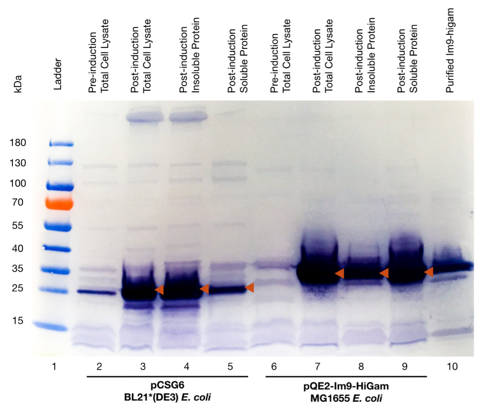
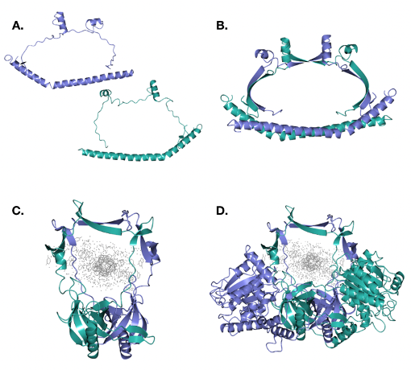
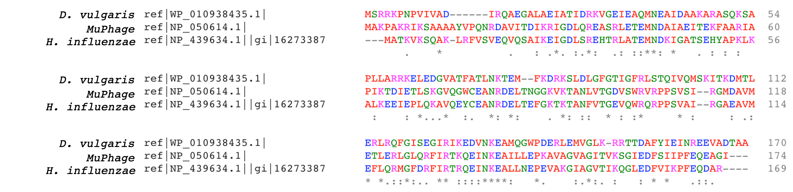
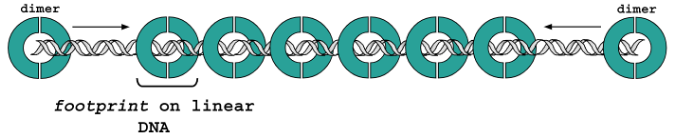

```{r setup, include = FALSE}
knitr::opts_chunk$set(
  include = FALSE,
  echo = FALSE,
  fig.align = "center",
  fig.retina = 3,
  message = FALSE,
  warning = FALSE
)
```

```{r pkgs}
# Load the tidyverse. Functions are used for tidying data and creating plots via ggplot2.
library(tidyverse)
# Load plotly. Plotly converts static ggplot to an interactive plot.
library(plotly)
# Load ggpubr. Combines multiple ggplots into a single plot.
library(ggpubr)
# Load RefManageR. Provides tools for importing and working with bibliographic references.
library(RefManageR)
# Load kableExtra. Table generation.
library(kableExtra)
# Load showtext. Allows use of Google fonts in ggplots.
library(showtext)
# Load wordcountaddin. Counts words and characters in text in an R markdown document.
library(wordcountaddin)
```

```{r themes}
# Importing custom themes and fonts.
font_add_google("Montserrat", "Montserrat")

# turn on showtext
showtext_auto()
source("theme.R", local = knitr::knit_global())
```

```{r import-bibliography}
# Biblography and in-text citation settings
RefManageR::BibOptions(
  check.entries = FALSE,
  bib.style = "authoryear",
  cite.style = "numeric",
  style = "markdown",
  hyperlink = "to.doc",
  dashed = FALSE,
  longnamesfirst = FALSE,
  max.names = 2
)
# Read in references for packages and literature/tools.
refs <-
  RefManageR::ReadBib("../bibliography/refs.bib", check = FALSE)
pkgs <-
  RefManageR::ReadBib("../bibliography/pkgs.bib", check = FALSE)
```
___
# Introduction

Double strand breaks (DSBs) are a form of DNA damage that results in the loss of bases on both strands of the DNA helix. They are commonly repaired by the non-homologous end-joining (NHEJ) pathway, which requires the protein Ku. Ku is a heterodimer of Ku70/Ku80 subunits. It identifies and binds to DSBs prior to NHEJ, and takes part in some transposition events `r Cite(refs, "DAdda_di_Fagagna2003-kb")`. Homologues of Ku have been found in many bacteria. The most well- known homologue of Ku is the Gam protein of the Mu bacteriophage. Mu is a temperate bacteriophage of Enterobacteria, particularly *Escherichia coli*. In bacteria, Mu acts as a transposable element `r Cite(refs, "Fuller2017-ex")` – meaning it can change its position within the genome and replicate by forming two replication forks `r Cite(refs, "Shapiro1979-gf")`. The Mu transposon involves 3 proteins: MuA, MuB, and MuGam `r Cite(refs, c("DAdda_di_Fagagna2003-kb", "Fuller2017-ex"))`. MuB polymerises adjacent to the *E. coli* target site and associates with MuA.MuA binds specific target sites and synapses them together to form the transposon. MuA remains bound until it is disassembled by the ATP-ClpX chaperone `r Cite(refs, "Harshey2012-qe")`. Meanwhile, MuGam binds to excised Mu phage DNA and protects it from digestion by host nucleases. Transposition events promote the uptake of foreign linear DNA: this function is known as natural competence and is linked to horizontal gene transfer (HGT). 
HGT is the transfer of foreign DNA between organisms and significantly contributes to the spread of antibiotic resistance and evolution in bacteria 
`r Cite(refs, "Gyles2014-wy")`.

```{r mu-fig, out.width = "80%", fig.cap = paste("Replicative transposition of Mu phage in E. coli showing the following structures: the phage genome (green), the transposase binding sites (red & blue), MuA (yellow), the transposition target (black), and the E. coli genome (grey). Adapted from", Cite(refs, textual = TRUE, "Fuller2017-ex"), "."), include = TRUE}


```

MuGam enables natural competence in *E. coli* and is therefore a putative agent of HGT. Bacteria possessing a Gam-like prophage region should also be naturally competent. In *Haemophilus influenzae*, Gam (HiGam) inhibits digestion of Mu phage DNA by nucleases `r Cite(refs, "DAdda_di_Fagagna2003-kb")`. Through sequence alignment, we identified and cloned a putative homologue of Mu phage Gam from *Haemophilus influenzae* (HiGam). The structure – including binding affinity, oligomeric state – of HiGam was assessed in comparison to MuGam in literature. A range of assays were used to achieve this; the aim of this report is to characterise HiGam by processing the data obtained from them.

___
# Requirements
Required software and packages are outlined in the [README](README.md).

___
# The Data
```{r functions}
# Source functions
source("../functions/relative_front.R", local = knitr::knit_global()) # Calculate relative front
source("../functions/nls.R", local = knitr::knit_global()) # Performs the NLS using the Langmuir binding isotherm (NLS)
source("../functions/emsa_pred_intercept.R", local = knitr::knit_global()) # Predicts the intercept of the EMSA data
source("../functions/sec_pred_intercept.R", local = knitr::knit_global()) # Predicts the intercept of the SEC data
source("../functions/sec_mw.R", local = knitr::knit_global()) # SEC molecular weights
source("../functions/sec_elution.R", local = knitr::knit_global()) # Extracting elution times from SEC analysis.
```

```{r data-import}
# Source raw data files and tidy heading names.
# Load the PCR data
pcr <- read.csv("../data/data-raw/pcr.csv", header = TRUE) %>%
  janitor::clean_names()

# Load the PCR calibration data for the gDNA library
gdna_calibration <-
  read.csv("../data/data-raw/pcr_gdna_calibration.csv", header = TRUE) %>%
  janitor::clean_names()

# Load the PCR calibration data for the cDNA library
cdna_calibration <-
  read.csv("../data/data-raw/pcr_cdna_calibration.csv", header = TRUE) %>%
  janitor::clean_names()

# Load the EMSA data
emsa <- read.csv("../data/data-raw/emsa.csv", header = TRUE) %>%
  janitor::clean_names()

# Load the EMSA calibration data
emsa_calibration <-
  read.csv("../data/data-raw/emsa_calibration.csv", header = TRUE) %>%
  janitor::clean_names()

# Load the SEC standards data
standards <-
  read.csv("../data/data-raw/sec_std.csv", header = TRUE) %>%
  janitor::clean_names()

# Load the SEC data
sec <-
  read.csv("../data/data-raw/sec_im9higam.csv", header = TRUE) %>%
  janitor::clean_names()

# Load the SDS Paage data
sds <-
  read.csv("../data/data-raw/sds.csv", header = TRUE) %>%
  janitor::clean_names()

# Load the SDS Calibration data
sds_calibration <-
  read.csv("../data/data-raw/sds_calibration.csv", header = TRUE) %>%
  janitor::clean_names()
```

```{r data-tidying}
# Prepare data by tidying where neccessary.
# Rename the proteins and pivot them
standards <- standards %>%
  rename(
    c(
      "Ferritin" = curve_ferritin,
      "IgG" = curve_ig_g,
      "Myoglobin" = curve_myoglobin,
      "Ovalbumin" = curve_ovalbumin,
      "Thyroglobulin" = curve_thyroglobulin,
      "Transferrin" = curve_transferrin,
      "Vitamin B12" = curve_vitamin_b12
    )
  ) %>%
  pivot_longer(cols = !c(x, vol),
               names_to = "protein",
               values_to = "absorbance_units")

# Pivot proteins
sec <- sec %>%
  pivot_longer(cols = starts_with("a"),
               names_to = "protein",
               values_to = "absorbance")

# Separate the PCR data set by DNA library for analysis
gdna <- pcr %>% # gDNA PCR data
  filter(library == "gDNA")

cdna <- pcr %>% # cDNA PCR data
  filter(library == "cDNA")
```

There are `r length(list.files("../data/data-raw"))` files containing data obtained from the assays. These are read into R `r Cite(pkgs, "base")` and tidied using the `tidyverse` `r Cite(pkgs, c("tidyverse", "tidyverse2019"))` package.

* EMSA
  + EMSA Calibration
* PCR
  + PCR Calibration for cDNA
  + PCR Calibration for gDNA
* SDS
  + SDS Calibration
  + SDS Standards
  + SDS Elution
  
___
# Analysis 
Analyses of data is executed in R `r Cite(pkgs, "base")`. Plots are created with `ggplot2` `r Cite(pkgs, "ggplot2")` and, where applicable, are made interactive with `plotly` `r Cite(pkgs, c("plotly", "plotly2020"))`.

## Identification & Alignment of MuGam Prophage Homologues {.tabset}
BLASTp `r Cite (refs, c("Abdeldaim2013-le", "Johnson2008-rl", "McGinnis2004-qg"))` was used to identify homologues of MuGam within Escherichia coli and Haemophilus influenzae. Significant sequences were aligned in COBALT `r Cite(refs, "Papadopoulos2007-zl")` and ClustalOmega `r Cite(refs, "Sievers2011-xs")` to yield the optimised alignment between MuGam, E. coli Gam and H. influenzae Gam (Fig. \@ref(fig:align-hi)). Prophage regions of H. influenzae were interrogated in PHASTER `r Cite(pkgs, "Arndt2016-bg")`, identifying two prophage regions, one of which was intact and derived from Enterobacteria phage Mu and contained homologues of MuA, MuB, and MuGam (Table \@ref(tab:blast-hi)). The H. influenzae homologues are potentially polycistronic, as they are oriented in the same way as Mu phage

### ClustalOmega Alignment) {-}
```{r align-hi, out.width = "80%", fig.cap = " Sequences with low E values and a percent identity of >50% were aligned in COBALT and ClustalOmega. Figure shows the ClustalOmega multiple alignment of MuGam (NP_050614.1), *Escherichia coli O157:H7 str. Sakai* (NP_312979.1), and *Haemophilus influenzae Rd KW20* (NP_439634.1). ‘*’ = residues in that column are identical in all aligned sequences, ‘:’ = conserved substitution has been observed,’.’ = semi-conserved substitutions are observed. RED = small, BLUE = acidic, MAGENTA = basic, GREEN = Hydroxyl + sulfhydryl + amine + G, GREY = Unusual amino/imino acids etc.", include = TRUE}


```

### Genetic Maps {-}
```{r maps, out.width = "80%", fig.cap = "Genetic maps for *Enterobacteria* MuPhage (GenBank NC_000829.1) and *Haemophilus influenzae* (GenBank NC_000907.1) produced with PHASTER. *H. influenzae* contained one intact 38.3Kb region with multiple open reading frames (ORFs). Labels identify MuGam and putative HiGam homologues.", include = TRUE}


```

### BLAST Alignment {-}
```{r blast-hi, include = TRUE}
# Creating a table for the alignments obtained in BLAST
blast_hi <- data.frame(
  "amplicon" = c("HiA", "HiB", "HiGam"),
  "e_value" = c("2e-149", "5e-86", "4e-70"),
  "percent_identity" = c("39.61", "46.44", "60.53")
)

blast_hi %>%
  knitr::kable(
    caption = " Mu homologues in H. influenzae were aligned in BLAST, identifying HiA, HiB, and HiGam. Their E values and percent identity are consistent with them being homologues of Mu.",
    digits = 2,
    col.names = c("Amplicon",
                  "E Value",
                  "Percent Identity (%)")
  ) %>%
  kable_styling(font_size = 15)

# Save processed Blast data
write.csv(blast_hi, '../data/data-processed/blast_hi.csv')
```

## Diagnostic PCR of the Mu Prophage Region in Haemophilus influenzae Genomic DNA and cDNA {.tabset}
```{r pcr-linear-models}
# Linear regression models on the PCR calibration data. We can predict our PCR amplicon sizes based on these using y = mx+c.
#gDNA
gdna_mod <- lm(data = gdna_calibration, log ~ rf)

#cDNA
cdna_mod <- lm(data = cdna_calibration, log ~ rf)
```

```{r pcr-preperation}
# Calculate the relative front (Rf), log = (y=mx+c), actual amplicon size, and percentage difference to the predicted size.

# gDNA
gdna <- gdna %>%
  mutate(
    rf = relative_front(gdna),
    # calculate the Rf
    log = ((rf * gdna_mod$coefficients[2]) + gdna_mod$coefficients[1]),
    # log = (y = mx+c)
    actual_size = (10 ^ log),
    # actual gene size = 10^log
    diff = ((expected_size - actual_size) / expected_size * 100) # % difference between expected and actual sizes
  )

# cDNA
cdna <- cdna %>%
  mutate(
    rf = relative_front(cdna),
    # calculate the Rf
    log = ((rf * cdna_mod$coefficients[2]) + cdna_mod$coefficients[1]),
    # log = (y = mx+c)
    actual_size = (10 ^ log),
    # actual gene size = 10^log
    diff = ((expected_size - actual_size) / expected_size * 100) # % difference between expected and actual sizes
  )

# Join gDNA & cDNA datasets for visualisation later on
pcr_full <- full_join(gdna, cdna, by = NULL)

# Save processed PCR data
write.csv(pcr_full, '../data/data-processed/pcr.csv')
```
Diagnostic PCR was used to amplify the *H. influenzae homologues* and test for their transcription relative to the Genomic DNA (gDNA) control. Amplicon sizes were established with equation \@ref(eq:log), using DNA ladder molecularweight (MW) standards. Results identified the transcription of HiA, HiB, HiGam, HiA-HiB and HiB-HiGam in *H. influenzae* (Fig. \@ref(fig:pcr-fig)).

\begin{equation}
\Large \color{#8D9FCA} y \color{#5a5a5a} = \color{#E789C2} m \color{#66c2a4} x \color{#5a5a5a} + \color{#FFD82F} c\\
\small \text{Where } \color{#8D9FCA} y = \text{log(DNA MW in bp), } \color{#E789C2} m = \text{gradient, } \color{#66c2a4} x = \text{Rf, and } \color{#FFD82F} c = \text{y-intercept}(\#eq:log)
\end{equation}

### PCR Expressed Amplicons {-}
```{r pcr-fig, include = TRUE, fig.cap = "Expression levels of HiA, HiB and HiGam ORFs in the complementary DNA (cDNA) and genomic DNA (gDNA) libraries, compared to their expected sizes. Results indicate that HiA, HiB and HiGam genes are expressed, and that poly-cistronic transcripts encoding HiA-HiB and HiB-HiGam gene pairs exist in *H. influenzae*."}
# ggplot2 column plot of the merged PCR data showing the expressed genes and the percentage difference of actual size to expected size.
pcr_plot <- pcr_full %>%
  ggplot(aes(
    x = gene,
    y = diff,
    fill = library,
    text = paste(
      "Library: ",
      library,
      "<br>Amplicon: ",
      gene,
      "<br>Difference: ",
      round(diff),
      "%",
      "<br>Expected Size (bp): ",
      expected_size,
      "<br>Actual Size (bp):",
      round(actual_size)
    )
  )) + geom_col(position = "dodge") +
  geom_hline(yintercept = 0, size = 0.25) +
  mytheme() +
  scale_fill_brewer(name = "DNA Library",
                    labels = c("cDNA", "gDNA"),
                    palette = "Set3",) +
  labs(y = "Percentage Difference to Expected Size",
       x = "Amplicon")

ggsave(
  "../figures/pcr_plot.pdf",
  plot = pcr_plot,
  height = 15,
  width = 20,
  unit = "cm"
)

# Make this interactive
ggplotly(pcr_plot, tooltip = c("text"), align = "center")
```

### PCR {-}
```{r pcr-atae-fig, out.width = "80%", fig.cap = " Diagnostic PCR analysis of Haemophilus influenzae gDNA and cDNA were analysed using 1.5% (w/v) agarose-TAE gel electrophoresis. Primers were used to determine whether HiA, HiB, and HiGam open reading frames were expressed in the cDNA library. In a separate reaction, gDNA was used as a positive control for PCR to define the size of expected amplicons.", include = TRUE}


```

### PCR Dataset {-}
```{r pcr-tab, include = TRUE}
# Kable table of the full PCR dataset with the calculated values.
pcr_full %>%
  select(-primer, -gel_length) %>%
  knitr::kable(
    caption = "The actual amplicon sizes were calculated using the linear regression equation \\@ref(eq:log) acquired by linear regression analysis of the PCR ladder bands. Size Difference compares the expected and actual amplicon sizes.",
    booktabs = T,
    digits = 2,
    col.names = c(
      "Library",
      "Amplicon",
      "Distance (cm)",
      "Expected Size (bp)",
      "Relative Front (Rf)",
      "Log(Rf)",
      "Actual Size (bp)",
      "Size Difference (%)"
    )
  ) %>%
  collapse_rows(columns = 1) %>%
  kable_styling(font_size = 15, position = "center")
```

___
## Assessing the Solubility of Two Different Recombinant Escherichia coli HiGam  {.tabset}
Cell lysates of two His-tagged `r Cite(refs, "Malhotra2009-du")` E. coli HiGam proteins, His$_{13}$-HiGam and His$_7$-Im9-HiGam, were fractionated into soluble and insoluble protein `r Cite(refs, c("Grabski2009-em", "Malhotra2009-du"))`. They were then analysed by SDS-PAGE and direct Western blotting (Fig. \@ref(fig:sds-fig)) to detect His-tagged protein within the fractions. Fractions were consistent with their expected molecular weights `r Cite(refs, c("Gasteiger2005-rh", "Gasteiger2003-ks"))` (Table \@ref(tab:sds-tab)). His$_7$-Im9-HiGam was determined to have the best solubility for overproducing HiGam.

### SDS-PAGE/Western Blot {-}
```{r sds-fig, include = TRUE, out.width = "80%", fig.cap = "Western blot of the SDS-PAGE analysis for BL21(DE3)* cells transformed with pCSG6 plasmid (His13-HiGam) and MG1655 cells transformed with pQE2-Im9-HiGam plasmid (His7-Im9-HiGam). Soluble fractions induced with His7-Im9-HiGam produced a higher yield than those induced with HiGam. Orange markers indicate the post-induction fractions for comparison."}


```

### Molecular Weight {-}

```{r sds-calib}
# Calculate the relative front and log10 weight for the SDS calibration data.
sds_calibration <- sds_calibration %>%
  mutate(rf = (
    (sds_calibration$gel_length - sds_calibration$distance) / sds_calibration$gel_length
  ),
  log = log10(weight_da))

# Save processed sds data
write.csv (sds_calibration,
           '../data/data-processed/sds_calibration.csv')

# Linear model of SDS log ~ rf to use in y=mx+c to predict sample weights.
sds_mod <- lm(sds_calibration$log ~ sds_calibration$rf)
```

```{r sds-tab, include = TRUE}
# Calculate the relative front (Rf), log = y=mx+c, 10^log = actual weight, and percentage difference to the predicted weight for the samples.
sds <- sds %>%
  mutate(
    rf = ((gel_length - distance) / gel_length),
    log = ((rf * sds_mod$coefficients[2]) + sds_mod$coefficients[1]),
    actual_weight = 10 ^ log,
    diff = ((expected_weight - actual_weight) / expected_weight) * 100
  )

# Kable table of the SDS data with calculated values.
sds %>% select(-log, -gel_length, -distance) %>%
  knitr::kable(
    caption = "Molecular weight was determined using Rf of bands and the linear regression equation acquired by the linear regression analysis of the MW ladder bands. Expected weights were obtained by ExPASy ProtParam.",
    booktabs = T,
    digits = 2,
    col.names = c(
      "Column",
      "Sample",
      "Expected Weight (Da)",
      "Relative Front (Rf)",
      "Actual Weight (Da)",
      "Size Difference (%)"
    )
  ) %>%
  collapse_rows(columns = 3) %>%
  kable_styling(font_size = 15, position = "center")
```


---
## Analyse DNA-Binding Properties of HiGam in EMSA {.tabset}
```{r emsa-prep}
# Prepare the calibration data by calculating the Rf and log10(expected size)
emsa_calibration <-
  emsa_calibration %>% mutate(log = log10(expected_size),
                              rf = relative_front(emsa_calibration))

# Prepare the PCR dataset for analysis by calculating the relative front.
emsa <-
  emsa %>% mutate(rf = (relative_front(emsa))) # calculate the relative front

# Calculate the difference between the measured rf and predicted rf value
# This is needed for the residuals
# Calculate residuals to the fit
emsa <- emsa %>%
  mutate(residuals = rf - predict(NLS(emsa)))

# Save processed data
write.csv (emsa, '../data/data-processed/emsa.csv')
```

```{r kd}
# Extract the Kd from the NLS for inline reporting.
kd <- summary(NLS(emsa))$coefficients[2, 1]
```

```{r emsa-footprint}
# Linear regression of the EMSA calibration data rf ~ log. Coefficients will be used to predict the size of HiGam + DNA.
emsa_lm <- lm(emsa_calibration$log ~ emsa_calibration$rf)

# Predict footpring using predicted HiGam size (y=mx+c), the avg weight of 500bp DNA (330000), and the weight of dimeric HiGam (30626.5 / 2).
emsa <- emsa %>%
  mutate(log = 1000 * ((rf * as.numeric(
    emsa_lm$coefficients[2]
  )) + as.numeric(emsa_lm$coefficients[1])))

emsa_footprint <-
  (500 / abs(((
    max(emsa$log) - 330000
  )) / (30626.5 / 2)))
```

Electrophoretic mobility shift assay (EMSA) was used to examine whether Im9-HiGam–DNA had an affinity for closed circular DNA or linear DNA. EMSA was performed using purified, recombinant Im9-HiGam, with supercoiled plasmid plasmid DNA and linear DNA templates. A fixed concentration of DNA was used with varying concentrations of Im9-HiGam to saturate binding to DNA. Rf was calculated in R using equation \@ref(eq:rf).

\begin{equation} 
\frac{(\text{gel length} - \text{distance})}{\text{gel length}}(\#eq:rf)
\end{equation}

In R `r Cite(pkgs, "base")`, NLS was used to predict the ($K_d$), and a linear model predicted the binding footprint. Im9-HiGam was observed to bind preferentially to linear DNA with a dissociation constant ($K_d$) of approximately `r signif(kd, digits = 2)`M (Fig. \@ref(fig:emsa-fig)). Results estimate Im9-HiGam has a binding dimeric footprint of approximately `r signif((emsa_footprint), digits = 2)` base pairs.

___
### EMSA Analysis {-}
```{r emsa-fig, include = TRUE, fig.cap = "The binding affinity (equilibrium dissociation constant, $K_d$) was estimated by nonlinear regression analysis (NLS) of EMSA using the Langmuir Binding Isotherm."}
emsa_plot <- emsa %>%
  ggplot(aes(x = conc, y = rf)) +
  geom_point(shape = 20,
             size = 3) +
  stat_function(fun = emsa_pred_intercept, colour = "#66C2A4") +
  mytheme() +
  scale_y_continuous(
    expand = c(0.02, 0.02),
    limits = c(0.3, 0.7),
    breaks = seq(0.3, 0.7, by = 0.20)
  ) +
  scale_x_continuous(
    expand = c(0.02, 0.02),
    limits = c(0, 4),
    breaks = seq(0, 8, by = 1)
  ) +
  xlab(NULL) +
  ylab(expression(paste(bold(
    "Relative Front (a.U.)"
  ))))

# Plot the residuals and a line showing y = 0
emsa_res_plot <- emsa %>%
  ggplot(aes(x = conc, y = residuals)) +
  geom_point(shape = 20,
             size = 3,
             colour = "#5a5a5a") +
  geom_hline(aes(yintercept = 0),
             col = '#66C2A4',
             size = .5) +
  scale_x_continuous(
    expand = c(0.02, 0.02),
    limits = c(0, 4),
    breaks = seq(0, 8, by = 1),
    name = (expression(bold(
      atop("Protein Concentration (μM)", "Im9"["dimer"])
    )))
  ) +
  scale_y_continuous(
    expand = c(0.02, 0.02),
    limits = c(-0.1, 0.1),
    breaks = seq(-0.1, 0.1, by = 0.1),
    name = "Residual (a.U.)"
  ) + mytheme()


emsa_full <- ggarrange(
  emsa_plot,
  emsa_res_plot,
  nrow = 2,
  ncol = 1,
  widths = c(2, 1 / 2)
)

emsa_full

ggsave(
  "../figures/emsa_plot.pdf",
  plot = emsa_full,
  height = 15,
  width = 20,
  unit = "cm"
)
```

### EMSA Dataset {-}
```{r emsa-tab, include = TRUE, fig.cap = "Molecular weight was determined using Rf (equation \\@ref(eq:rf)) of bands and the linear regression equation acquired by the linear regression analysis of the MW ladder bands. Expected weights were obtained by ExPASy ProtParam"}
# Kable table of the EMSA Dataset
emsa %>%
  select(-gel_length) %>%
  knitr::kable(
    digits = 2,
    col.names = c(
      "Concentration",
      "Distance",
      "Relative Front",
      "Residuals",
      "Actual Weight (Da)"
    )
  ) %>%
  kable_styling(font_size = 15, position = "center")
```

___
## Size Exclusion Chromatography (SEC) {.tabset}
```{r sec-standards}
# Prepare the standards data
sec_standards <- standards %>%
  group_by(protein) %>%
  filter(absorbance_units == max(absorbance_units)) %>% # filter by the maximum absorbency units
  summarise(vol) %>%
  ungroup() %>%
  mutate(
    mw = recode(
      # Add a column for the molecular weights of each protein
      # Protein MWs
      protein,
      "Thyroglobulin" = 669000,
      "Ferritin" = 440000,
      "IgG" = 150000,
      "Transferrin" = 81000,
      "Ovalbumin" = 43000,
      "Myoglobin" = 17000,
      "Vitamin B12" = 1355
    ),
    logmw = log(mw) # log10 of the MW
  )

# Save processed data
write.csv(sec_standards, '../data/data-processed/sec_standards.csv')
```

```{r sec-mw}
# Getting the elution volume that corresponds to the maximum value of a curve
# a280 elution volume
a280_elution <-
  format(round(sec_elution("a280"), digits = 2), scientific = FALSE)
# a254 elution volume
a254_elution <-
  format(round(sec_elution("a254"), digits = 2), scientific = FALSE)

# Getting the molecular weight for the max elution for each wavelength using the sec_mw function
# a280 mw
a280_mw <- sec_mw("a280") # protein
# a254 mw
a254_mw <- sec_mw("a254") # protein + DNA

# Footprint size estimated by SEC
# footprint = a245 (protein + DNA) - a280 (protein) / avg base pair weight (660)
sec_footprint <-
  as.numeric(round((a254_mw - a280_mw) / 660, digits = 2))

# Format mws for inline reporting
a280_mw <- format(round(a280_mw, digits = 2), scientific = FALSE)
a254_mw <- format(round(a254_mw, digits = 2), scientific = FALSE)
```

Size exclusion chromatography (SEC) was used to explore the molecular weight and oligomeric state of Im9-HiGam. 7 chromatograms of known MW were plotted (Fig. \@ref(fig:sec-std-fig)) and a linear regression was performed to determine the relationship between elution volume and molecular weight (Fig. \@ref(fig:sec-calib-fig)). The SEC data showed a peak for both wavelengths, with a MW of approximately `r a254_mw` Daltons for $A_{254}$ and `r a280_mw` Daltons for $A_{280}$ (Fig. \@ref(fig:sec-fig)). This gives Im9-HiGam has an estimated monomeric footprint of approximately `r sec_footprint` base pairs.

### SEC Elution {-}
```{r sec-fig, include = TRUE, fig.cap = "Plot of $A_{254}$ (DNA absorption) and $A_{280}$ (protein absorption) SEC data vs. elution volume for Im9-HiGam. The MW of both peaks was determined using the linear regression equation acquired by linear regression analysis of protein standards (Fig \\@ref(fig:sec-std-fig) and \\@ref(fig:sec-calib-fig))."}

# Plot of the standards elution volumes
sec_plot <- sec %>%
  mutate(protein = recode(protein, "a280" = "A280", "a254" = "A254")) %>%
  ggplot(aes(x = vol,
             y = absorbance,
             colour = protein),
         show.legend = TRUE) +
  geom_line() +
  scale_colour_brewer(name = "Protein",
                      palette = "Set2") +
  scale_x_continuous(limits = c(13, 17)) +
  scale_y_continuous(expand = c(0, 0),
                     limits = c(0, 100)) +
  mytheme() +
  xlab("Elution Volume (mL)") +
  ylab("Absorbance (mAU)")

ggsave(
  "../figures/sec_plot.pdf",
  height = 15,
  width = 20,
  unit = "cm"
)

# make plot interactive with ggplotly
ggplotly(align = "center")
```

### SEC Standards {-}
```{r sec-std-fig, include = TRUE, fig.cap = "Molecular weight standards using the following calibration globular proteins: Thyroglobulin, Ferritin, IgG, Transferrin, Ovalbumin, Myoglobin, and Vitamin B12."}
# Plot the SEC standards
standards_plot <- standards %>%
  ggplot(aes(x = vol,
             y = absorbance_units,
             colour = protein),
         show.legend = TRUE) +
  geom_line() +
  scale_colour_brewer(name = "Protein",
                      palette = "Set2") + # colour blind friendly
  mytheme() +
  scale_x_continuous(
    expand = c(0, 0),
    limits = c(9, 22),
    breaks = seq(9, 22, by = 1),
    name = "Elution Volume (mL)"
  ) + scale_y_continuous(
    expand = c(0, 0),
    limits = c(0, 100),
    breaks = seq(0, 100, by = 10),
    name = "A280 Absorbance Units (A.U.)"
  )

# Make this interactive
ggplotly(standards_plot)

# Save the plot as an image
ggsave(
  "../figures/standards_plot.pdf",
  plot = standards_plot,
  height = 15,
  width = 20,
  unit = "cm"
)
```

### SEC Calibration Plot {-}
```{r sec-calib-fig, include = TRUE, fig.cap = "Plot of the elution volume vs log(molecular weight) for the 7 standard proteins (Fig \\@ref(sec-std-fig))."}
# Plot the standards elution against MW and predict the intercept using sec_pred_intercept function
sec_std_plot <- sec_standards %>%
  ggplot(mapping = aes(y = vol, x = logmw)) +
  geom_point() +
  stat_function(fun = sec_pred_intercept, # Cannot be made interactive as stat_function incompatible
                geom = "line",
                colour = "#8D9FCA") +
  mytheme() +
  scale_x_continuous(
    expand = c(0.05, 0.05),
    limits = c(7, 14),
    breaks = seq(7, 14, by = 1),
    name = "Log (MW)"
  ) + scale_y_continuous(
    expand = c(0.05, 0.05),
    limits = c(10, 22),
    breaks = seq(10, 22, by = 2),
    name = "Elution Volume (mL)"
  )
sec_std_plot

# Save plot as an image
ggsave(
  "../figures/sec_std_plot.pdf",
  plot = sec_std_plot,
  height = 15,
  width = 20,
  unit = "cm"
)
```

### SEC Dataset {-}
```{r sec-tab, include = TRUE, fig.cap = "SEC Dataset"}
# Plot the processed SEC data into a Kable table
sec %>%
  select(-x) %>%
  pivot_wider(names_from = "protein", # pivot to make more human-readable
              values_from = "absorbance") %>%
  knitr::kable(
    booktabs = T,
    digits = 2,
    col.names = c("Volume",
                  "A254",
                  "A280")
  ) %>%
  kable_styling(font_size = 15) %>%
  scroll_box(height = "300px")

# Save processed data
write.csv(sec, '../data/data-processed/sec.csv')
```

# {-}
# Discussion
Mu is a phage of *E. coli*, which is an Enterobacteria. So, we looked to identify sequence homologues of MuGam in other species. Similarity to Mu was identified in a range of bacteria, including *Salmonella*, *Shigella*, *E. coli sakai* and *Haemophilus influenzae*. *H. influenzae* was selected for analysis as it is a naturally competent bacterial strain. In Mu, the $P_e$ RNA promoter `r Cite(refs, "Stoddard1989-xc")` upstream of MuA, MuB and MuGam enables operon-like polycistronic transcription. Hence, the same would be expected of Mu homologues (designated HiA, HiB, and HiGam). We found that *H. influenzae* contained an intact plasmid with sequences and orientations consistent with being homologues of MuA, MuB, and MuGam (Fig. \@ref(fig:align-hi), \@ref(fig:maps), & Table \@ref(tab:blast-hi)). The percent identities for HiA and HiB were both <50%, which raises concerns as to whether the proteins will be functional. Their activity could be analysed by reconstituting a transposon in vitro using recombinant HiA and HiB `r Cite(refs, "Mizuuchi1983-qq")`.

## Oligomeric State & Binding Preference of HiGam
The structure of HiGam has previously modelled on eukaryotic Ku `r Cite(refs, "DAdda_di_Fagagna2003-kb")`, as shown in Fig. \@ref(fig:ku). However, a homologue of MuGam from *Desulfovibrio vulgaris* (DvGam) is known to have a structure much like Ku and is the same solution states as both Ku and MuGam. The central cavity of the *D. vulgaris* Gam model `r Cite(refs, "Bhattacharyya2018-ok")`, however, is twice as wide as that in Ku. This could potentially allow binding to two helices of DNA, aiding in the formation of two replication forks typical of transposable events (see Fig. \@ref(fig:mu-fig)).

```{r ku, include = TRUE, out.width = "80%", fig.cap = "A. Structural model of Desulfovibrio vulgaris Gam Homologue. B. Structural model of Desulfovibrio vulgaris Gam Dimer C. Model of HiGam-DNA complex based on homology with Ku70/Ku80 heterodimer D. Structure of the eukaryotic Ku-DNA complex."}


```

Alignment in BLASTp `r Cite (refs, c("Abdeldaim2013-le", "Johnson2008-rl", "McGinnis2004-qg"))` showed no significant similarity between Human Ku with H. influenzae, nor MuGam. However, *D. vulgaris* Mu shared a similarity of ~27% with both *H. influenzae* and MuPhage (Table \@ref(tab:blast-mu) and Fig. \@ref(fig:align-dv)). This information would advocate for DvGam as a more appropriate than Ku for developing a homology model of the crystal structure of HiGam.

### {.tabset}
#### BLAST Alignment {-}
```{r blast-dv, include = TRUE, out.width = "80%", fig.cap = "BLASTp sequence alignments of *Desulfovibrio vulgaris* (WP_010938435), MuPhage (NP_050614.1), and *Haemophilus influenzae* (NP_439634.1). No significant similarity was identified between the former and Ku70 (P12956.2) or Ku80 (P13010.3)."}
# Create a dataframe for the output of the BLAST alignments
blast_mu <- data.frame(
  "sequence_1" = c("H. influenzae", "MuPhage", "H. influenzae"),
  "e_value" = c("1e-09", "2e-10", "9e-08"),
  "percent_identity" = c(27.10, 26.32, 27.66),
  "sequence_2" = c("D. vulgaris", "MuPhage", "D. vulgaris")
)

# Create a Kable table for this blast_mu data
blast_mu %>%
  knitr::kable(
    digits = 2,
    col.names = c("Sequence 1",
                  "E Value",
                  "Percent Identity",
                  "Sequence 2")
  ) %>%
  kable_styling(font_size = 15)

# Save processed data
write.csv(blast_mu, '../data/data-processed/blast_mu.csv')
```

#### ClustalOmega Alignment {-}
```{r align-dv, out.width = "100%", fig.cap = "ClustalOmega multiple alignment of *Desulfovibrio vulgaris* (WP_010938435), MuPhage (NP_050614.1), and *Haemophilus influenzae* (NP_439634.1).  ‘*’ = residues in that column are identical in all aligned sequences, ‘:’ = conserved substitution has been observed,’.’ = semi-conserved substitutions are observed. RED = small, BLUE = acidic, MAGENTA = basic, GREEN = Hydroxyl + sulfhydryl + amine + G, GREY = Unusual amino/imino acids etc.", include = TRUE}

```

### {-}
MuGam non-specifically binds to double-stranded linear DNA `r Cite(refs, "Bhattacharyya2018-ok")`, with an estimated $K_d$ of 1.2 x 10$^{-8}$M. MuGam is a homodimer that forms a ring-like crystal structure, preventing it from binding to circular DNA (Fig. \@ref(fig:ring-fig)). The binding ability of HiGam was tested with an electrophoretic mobility shift assay (EMSA). Historically, MuGam has poor solubility `r Cite(refs, "Abraham1990-ec")`. Since we’d expect the same from HiGam, the solubility of fusion proteins for EMSA analysis was compared (Fig. 5 & Table 4). His13-HiGam exhibited poor solubility, whereas His7-Im9-HiGam had improved levels of solubility. The poor solubility of HiGam lacking Im9 creates speculation as to whether translated HiGam will be soluble in the bacterium. As predicted, Im9-HiGam bound preferentially to linear DNA. Analysis non-linear regression analysis using the Langmuir Isotherm showed that Im9-HiGam bound to linear DNA with an estimated $K_d$ (affinity) of approximately `r signif(kd, digits = 2)`M. Both the KD of MuGam and HiGam are considered high. This value alone isn’t significant – fluorescence anisotropy (FA) could be used to improve the accuracy of the $K_d$ `r Cite(refs, "Bhattacharyya2018-ok")`.

```{r ring-fig, include = TRUE, out.width = "80%", fig.cap = "Diagrams shows how the ring structure of homodimer MuGam binds to linear DNA. MuGam ‘slides’ onto linear DNA. The ring structure is closed, so MuGam cannot bind to circular DNA."}



```


## Molecular Weight of HiGam
We had previously determined molecular weight with ExPASy Protparam and SDS-PAGE. However, both methods are based on amino acid content and give the mass of a monomer. Therefore, we used size exclusion chromatography (SEC) to determine the oligomeric state of HiGam. SEC of HiGam has previously indicated that it is also a dimer by producing molecular weights roughly twice that of a monomer `r Cite(refs, "DAdda_di_Fagagna2003-kb")`.

Our SEC analysis was performed by lysing cells that Im9-HiGam with a DNase buffer. Samples were measured at two absorbances to detect DNA ($A_{254}$) and protein ($A_{280}$). DNA is present despite the use of DNase (Fig. \@ref(fig:sec-fig)). This is because, as we know from the SDS-PAGE, Im9-HiGam binds to linear DNA. Any DNA bound to Im9-HiGam is protected from DNase activity. This is reflective of the function observed in MuGam, which binds to linear DNA to protect it from exonucleases. Therefore, the peak at $A_{254}$ is the molecular weight of both DNA and Im9-HiGam. While the peak at $A_{280}$ is just protein, so we would assume that this is the molecular weight of Im9-HiGam alone. 

```{r mw-tab, include = TRUE}
# Create a dataframe to compare the estimate molexular weights to those listed in ProtParam
mw <- data.frame(
  "higam" = c(
    "His13-HiGam Monomer",
    "His13-HiGam Dimer",
    "His7-HiGam Monomer",
    "His7-HiGam Dimer"
  ),
  "prot_param" = c("22491.54", "44983.08", "30626.50", "61253.00"),
  "sds_page" = c(
    sds$actual_weight[2], # Extracting MW from the SDS data
    sds$actual_weight[2] * 2, # Multiply to get the dimer MW
    sds$actual_weight[6],
    sds$actual_weight[6] * 2 # Multiply to get the dimer MW
  ),
  "sec" = c(NA, NA, (as.numeric(a280_mw) / 2), a280_mw) # MW estimated by SEC
)

# Make a Kabe table for the MW data
mw %>% knitr::kable(
  caption = "Molecular weight was determined using Rf of bands and the linear regression equation acquired by the linear regression analysis of the MW ladder bands. Expected weights were obtained by ExPASy ProtParam.",
  digits = 2,
  col.names = c("HiGam",
                "ProtParam",
                "SDS-PAGE",
                "SEC")
) %>%
  kable_styling(font_size = 15)

# Save processed data
write.csv(mw, '../data/data-processed/mw.csv')
```

The molecular weight of Im9-HiGam determined by SEC is consistent with those given by ExPASy ProtParam `r Cite(refs, c("Gasteiger2005-rh", "Gasteiger2003-ks"))` and the SDS-PAGE analysis (Table \@ref(tab:mw-tab)). This is substantial evidence to propose that HiGam is a homodimer, as predicted by homology models (Fig. \@ref(fig:ku) B & C), even in the absence of solution. To further support this value, the sedimentation equilibrium analytical ultracentrifugation (seAUC) could be used as another non-destructive method of analysing the molecular weight of HiGam in solution `r Cite(refs, "Rhodes2009-uq")`.

```{r footprint-tab, include = TRUE}

# Make a data frame comparing the binding footprint sizes estimated by EMSA and SEC 
footprints <- data.frame(
  "His7-Im9-HiGam" = c("Monomer", "Dimer"),
  "EMSA" = c(emsa_footprint/2, emsa_footprint ), # Extracting EMSA footprints
  "SEC" = c(NA, sec_footprint) # Extracting SEC footprint
)

# Make a Kable table for the footprint estimates
footprints %>% knitr::kable(
  caption = "Comparison of the estimate DNA footprints for Im9-HiGam obtained from EMSA and SEC analysis. EMSA’s result was doubled to obtain the dimer value. The result of SEC proposes HiGam is a dimer.",
  digits = 2,
  col.names = c("His7-Im9-HiGam",
                "EMSA",
                "SEC")
) %>%
  kable_styling(font_size = 15)

# Save processed data
write.csv(footprints, '../data/data-processed/footprints.csv')
```


The size of the DNA binding footprint was determined by EMSA and SEC analysis are consistent with one another (Table \@ref(tab:footprint-tab)). Though, SEC analysis of Ku and DvGam should be performed for comparison, as this will help us understand which homology model is most appropriate. As DvGam has a central cavity twice the size of Ku `r Cite(refs, "Bhattacharyya2018-ok")`, we would expect its binding footprint to appear smaller than Ku.

# Conclusion
We have established that *Haemophilus influenzae* contains a prophage region derivative of Mu, containing a homologue of MuGam. In these assays, HiGam demonstrated homology to MuGam: HiGam too binds to linear DNA with a strong affinity, and evidence points to it being a dimer, even in the absence of solution. However, there are a significant number of sequence truncations to imply that HiGam may not be translated or functional in vivo. Further assays, as mentioned, will need to confirm this. Though, even if this were not the case, we would still need to establish whether functional HiGam has an impact on the level of horizontal gene transfer within *H. influenzae.*

___
**This Document:** 
`r word_count("report.Rmd")`\
**README:** 
`r word_count("../README.md")`\
**Total:** 
`r word_count("report.Rmd") + word_count("../README.md")`\

___
Report made with `rmarkdown` 
`r Cite(pkgs, c("rmarkdown","rmarkdown2018", "rmarkdown2020"))`, 
`RefManageR`
`r Cite(pkgs, "RefManageR")`.\

Theme is *Minty* by [Bootswatch](https://bootswatch.com/minty/).

___
# Bibliography {.tabset}
## References {-}
```{r refs-bib, include = TRUE, results =  "asis"}
RefManageR::PrintBibliography(refs)
```

## Packages {-}
```{r pkgs-bib, include = TRUE, results = "asis"}
RefManageR::PrintBibliography(pkgs)
```
